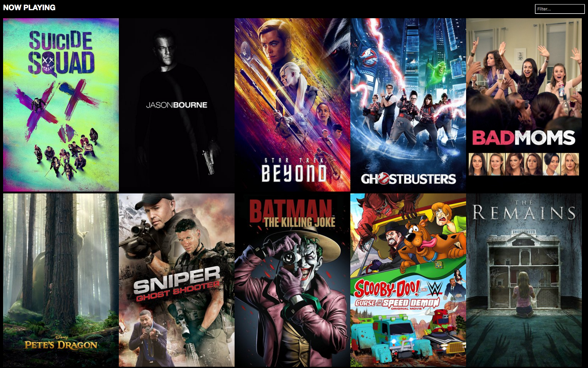

# angular-now-playing - Example Angular Application

This repository contains an example Angular application that displays movies currently at the theater. It was built solely as an example of using Angular and is not intended to be used beyond the learning experience. 

The project utilizes the [TMDb API](https://www.themoviedb.org/).

Note: the image shown above is not owned by Keyhole, and all copyrights belong to their respective owners. The image used here is only for education and is not intended to generate income.

##Getting Started

Prerequisites: You must have Node/npm installed.

1. npm install
2. npm start

This will run lite-server with Browsersync enabled.  It should automatically launch your default web browser on http://localhost:3000.

If you are interested in Angular 2, then [check this out](https://github.com/in-the-keyhole/angular2-now-playing).

All public Keyhole Software educational events can be found on the [Keyhole Eventbrite page](http://www.eventbrite.com/o/keyhole-software-2942446951).

This content is from [Keyhole Software](https://keyholesoftware.com). We love knowledge transfer!
